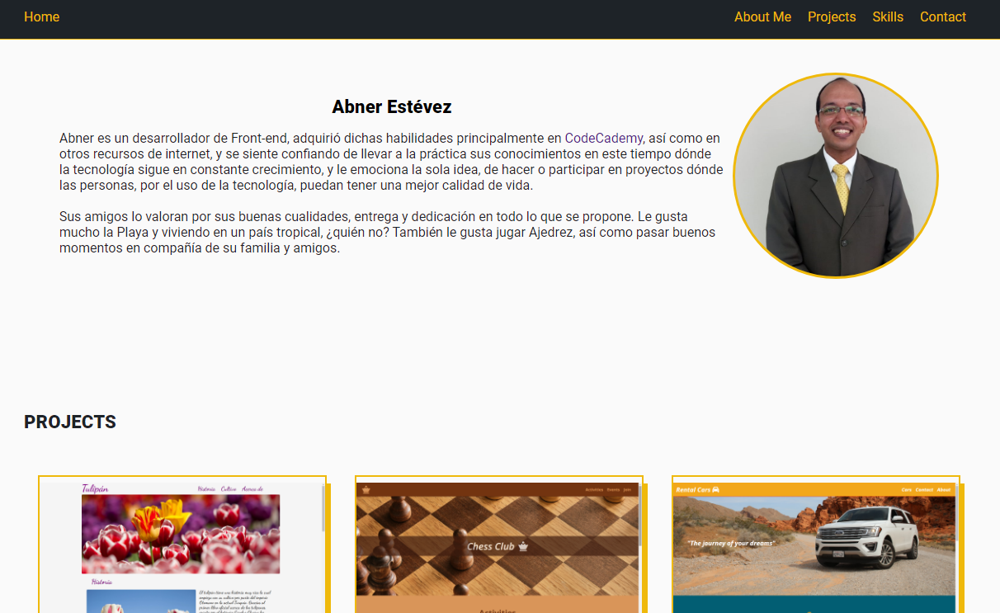

# Portfolio Website

## ¡Hola! 😀

Bienvenido a mí portafolio website. Aquí les hablo un poquito sobre mí y los proyectos
que he realizado.

## Objetivo

Es una manera de mostrar visualmente mis capacidades como desarrollador **Front-end.**
Y en verdad ese es el objetivo de este website, a medida que siga trabajando en nuevos proyectos y
siga adquiriendo nuevas habilidades, será el lugar perfecto para saber todo sobre mí.

## Créditos

Este ha sido un camino desafiante, pero al mismo tiempo emocionante y ha sido gracias a direferentes
recursos de internet por los cuales estoy muy agradecido:

1. [CodeCademy](https://www.codecademy.com/)
2. [Udemy](https://www.udemy.com/) con FalconMasters
3. [YouTube](https://www.youtube.com/c/YoelvisM) Yoelvis Mulen

Gracias!! 👏